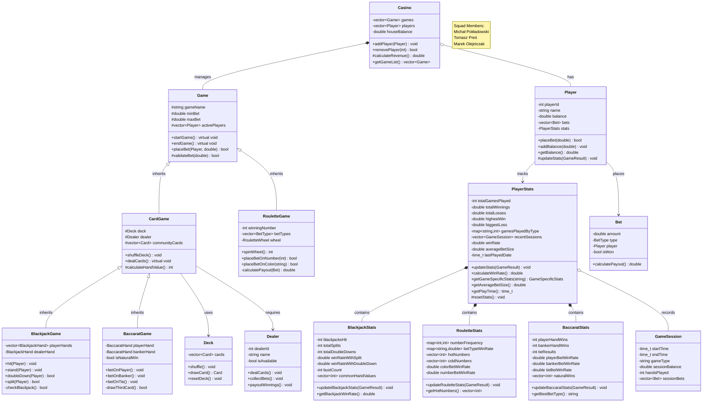

```mermaid
classDiagram
    note "Squad Members:
    Michał Pokładowski
    Tomasz Preś
    Marek Olejniczak"

    class Casino {
        -vector~Game~ games
        -vector~Player~ players
        -double houseBalance
        +addPlayer(Player) void
        +removePlayer(int) bool
        #calculateRevenue() double
        +getGameList() vector~Game~
    }

    class Game {
        #string gameName
        #double minBet
        #double maxBet
        #vector~Player~ activePlayers
        +startGame() virtual void
        +endGame() virtual void
        +placeBet(Player, double) bool
        #validateBet(double) bool
    }

    class Player {
        -int playerId
        -string name
        -double balance
        -vector~Bet~ bets
        -PlayerStats stats
        +placeBet(double) bool
        +addBalance(double) void
        +getBalance() double
        #updateStats(GameResult) void
    }

    class CardGame {
        #Deck deck
        #Dealer dealer
        #vector~Card~ communityCards
        +shuffleDeck() void
        +dealCards() virtual void
        #calculateHandValue() int
    }

    class BlackjackGame {
        -vector~BlackjackHand~ playerHands
        -BlackjackHand dealerHand
        +hit(Player) void
        +stand(Player) void
        +doubleDown(Player) bool
        +split(Player) bool
        -checkBlackjack() bool
    }

    class RouletteGame {
        -int winningNumber
        -vector~BetType~ betTypes
        -RouletteWheel wheel
        +spinWheel() int
        +placeBetOnNumber(int) bool
        +placeBetOnColor(string) bool
        -calculatePayout(Bet) double
    }

    class BaccaratGame {
        -BaccaratHand playerHand
        -BaccaratHand bankerHand
        -bool isNaturalWin
        +betOnPlayer() void
        +betOnBanker() void
        +betOnTie() void
        -drawThirdCard() bool
    }

    class PlayerStats {
        -int totalGamesPlayed
        -double totalWinnings
        -double totalLosses
        -double highestWin
        -double biggestLoss
        -map~string,int~ gamesPlayedByType
        -vector~GameSession~ recentSessions
        -double winRate
        -double averageBetSize
        -time_t lastPlayedDate
        +updateStats(GameResult) void
        +calculateWinRate() double
        +getGameSpecificStats(string) GameSpecificStats
        +getAverageBetSize() double
        +getPlayTime() time_t
        #resetStats() void
    }

    class BlackjackStats {
        -int blackjacksHit
        -int totalSplits
        -int totalDoubleDowns
        -double winRateWithSplit
        -double winRateWithDoubleDown
        -int bustCount
        -vector~int~ commonHandValues
        +updateBlackjackStats(GameResult) void
        +getBlackjackWinRate() double
    }

    class RouletteStats {
        -map~int,int~ numberFrequency
        -map~string,double~ betTypeWinRate
        -vector~int~ hotNumbers
        -vector~int~ coldNumbers
        -double colorBetWinRate
        -double numberBetWinRate
        +updateRouletteStats(GameResult) void
        +getHotNumbers() vector~int~
    }

    class BaccaratStats {
        -int playerHandWins
        -int bankerHandWins
        -int tieResults
        -double playerBetWinRate
        -double bankerBetWinRate
        -double tieBetWinRate
        -vector~int~ naturalWins
        +updateBaccaratStats(GameResult) void
        +getBestBetType() string
    }

    class GameSession {
        -time_t startTime
        -time_t endTime
        -string gameType
        -double sessionBalance
        -int handsPlayed
        -vector~Bet~ sessionBets
    }

    class Dealer {
        -int dealerId
        -string name
        -bool isAvailable
        +dealCards() void
        +collectBets() void
        +payoutWinnings() void
    }

    class Deck {
        -vector~Card~ cards
        +shuffle() void
        +drawCard() Card
        +resetDeck() void
    }

    class Bet {
        -double amount
        -BetType type
        -Player player
        -bool isWon
        +calculatePayout() double
    }

    Casino *-- Game : manages
    Game <|-- CardGame : inherits
    CardGame <|-- BlackjackGame : inherits
    CardGame <|-- BaccaratGame : inherits
    Game <|-- RouletteGame : inherits
    Casino o-- Player : has
    Player --> PlayerStats : tracks
    CardGame --> Deck : uses
    Player --> Bet : places
    CardGame --> Dealer : requires
    PlayerStats *-- BlackjackStats : contains
    PlayerStats *-- RouletteStats : contains
    PlayerStats *-- BaccaratStats : contains
    PlayerStats o-- GameSession : records


```
